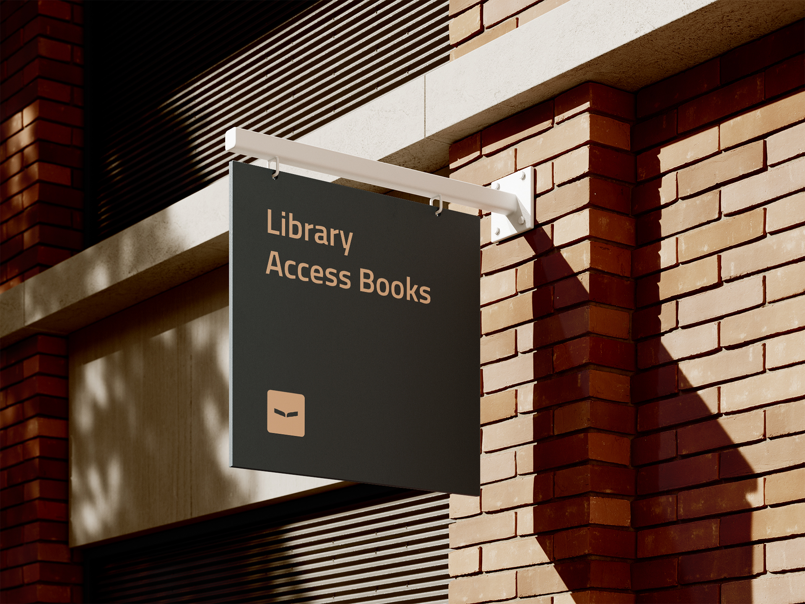
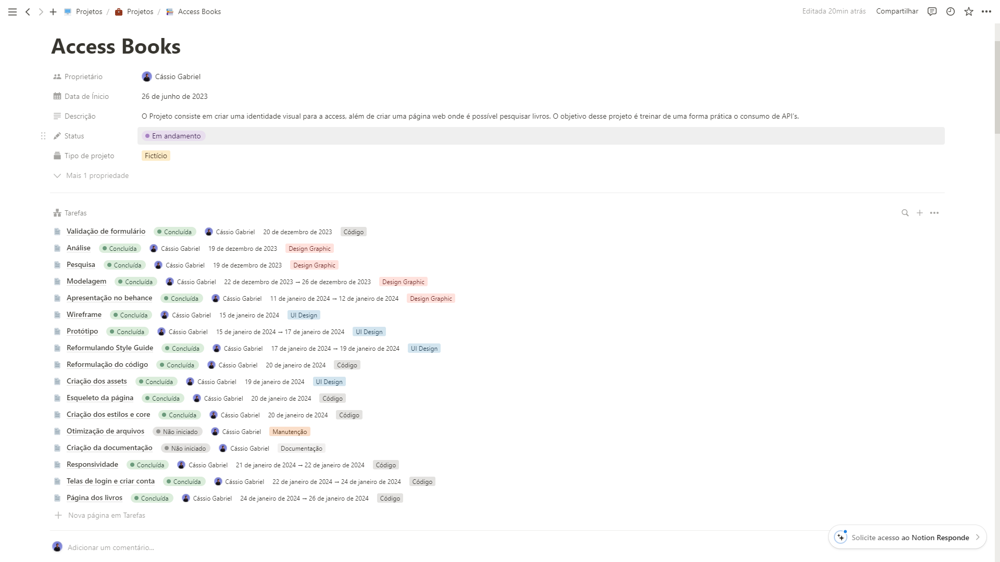
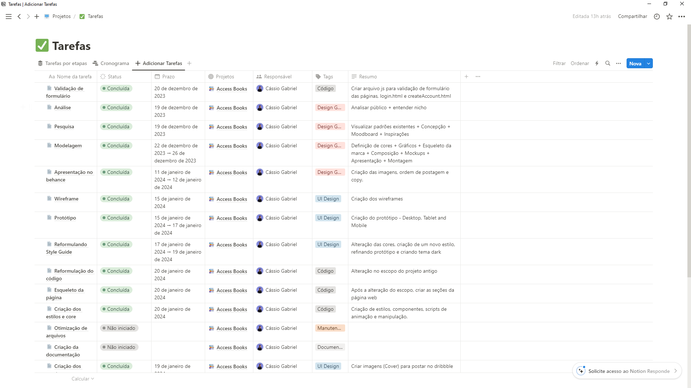
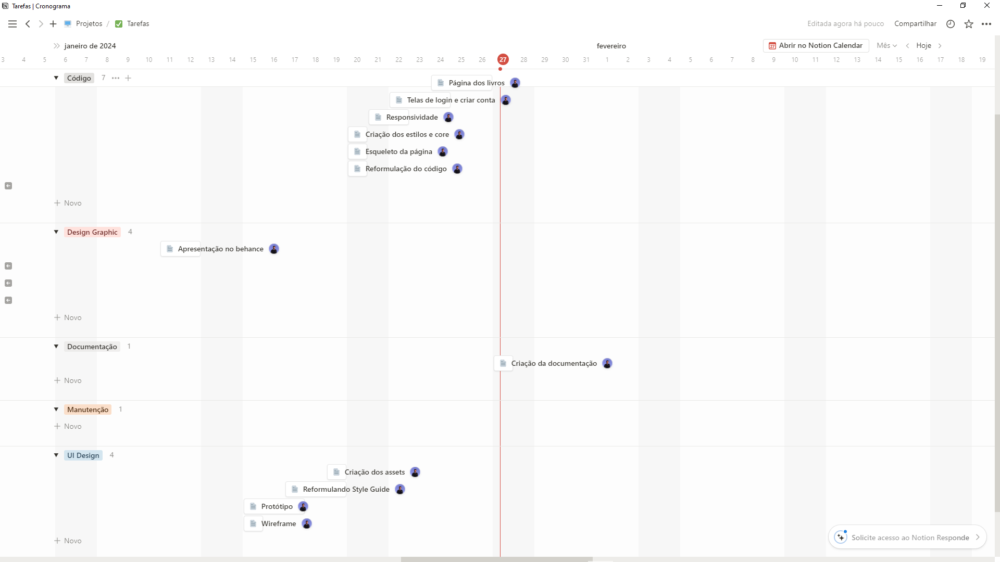
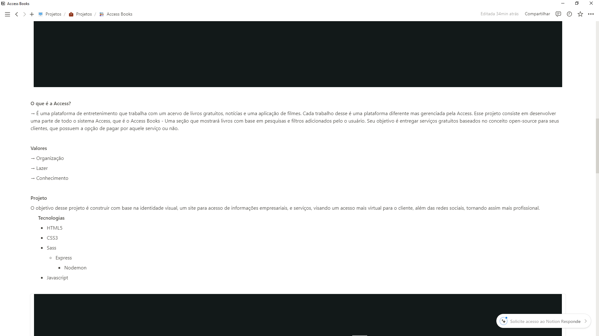
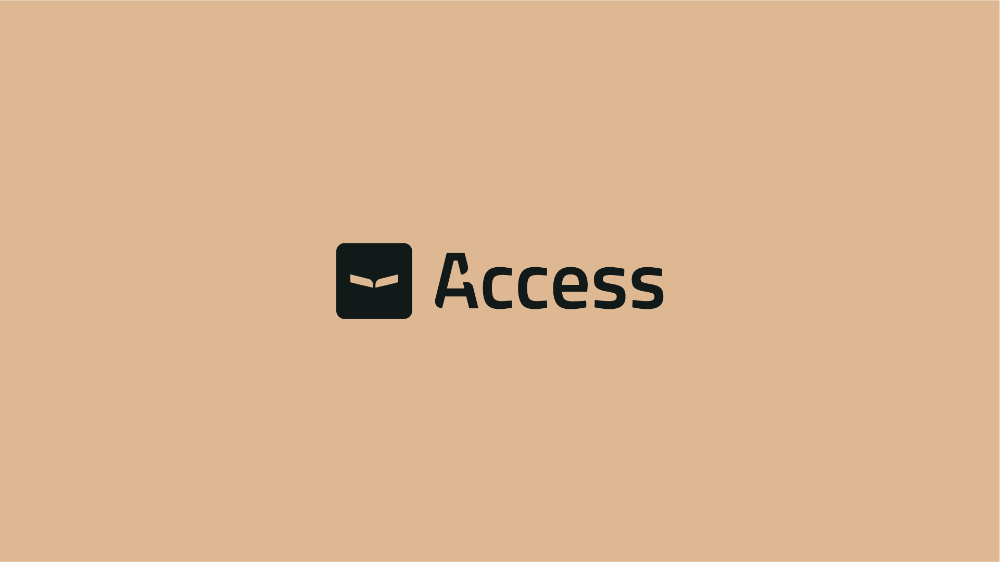
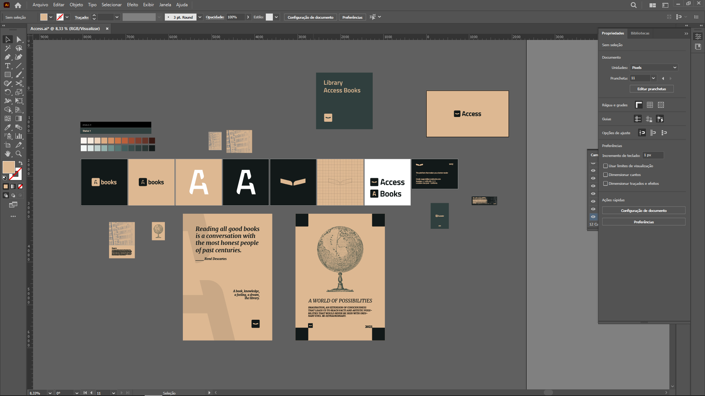
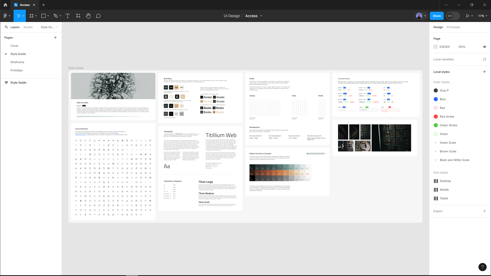
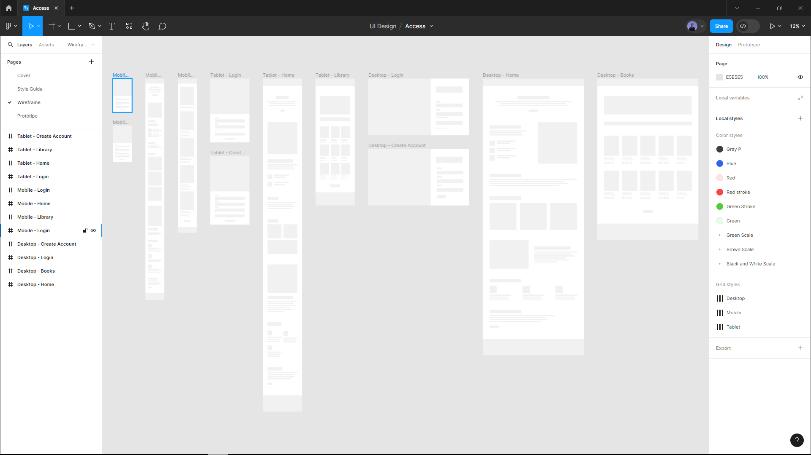
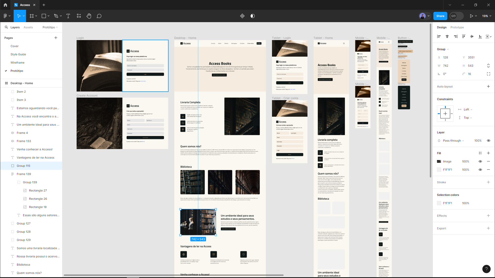

# Access Books

Access books é um projeto fictício que tem como objetivo praticar meus estudos de uma forma conceitual, tentando estar o mais próximo dos processos de um projeto real.

**Tecnologias Utilizadas** -> HTML, CSS, Js e Express.

### O que é a Access (Fictício)

---

É uma plataforma de entretenimento que trabalha com um acervo de livros gratuitos, notícias e uma aplicação de filmes. Cada trabalho desse é uma plataforma diferente mas gerenciada pela Access. Esse projeto consiste em desenvolver uma parte de todo o sistema Access, que é o Access Books - Uma seção que mostrará livros com base em pesquisas. Seu objetivo é entregar serviços gratuitos baseados no conceito open-source para seus clientes, que possuem a opção de pagar por aquele serviço ou não.

### Processo

Todo processo foi documentado pela plataforma [Notion](https://www.notion.so/pt-br) onde eu separei por etapas maiores. O projeto foi desenvolvido em três etapas, que são:

- **Identidade visual** - criar uma marca autêntica para seguir princípios e padrões que a empresa fictícia possui.
- **UI Design** - o desenvolvimento front-end da plataforma seguindo regras e padrões do meu processo criativo.
- **Front-end** - Programação da plataforma front-end.

Dentro dessas etapas possuem tarefas e sub-tarefas onde pude organizar de maneira eficaz e saber o que fazer em cada processo. Toda tarefa possui uma descrição do que deve ser feito. Abaixo você encontra algumas imagens de cada etapa e algumas tarefas.

#### Identidade Visual

Essa foi a primeira etapa a ser desenvolvida, Caso tenha interesse em saber como ficou, postei a identidade no meu [Behance](https://www.behance.net/gallery/188768665/Access-Books?tracking_source=search_projects|access+books&l=1). Utilizando o briefing como referência para poder desenvolver a marca, seguindo os seguintes valores que a mesma possui - Organização, Lazer e Conhecimento - com um objetivo simples e direto _O conhecimento é leve e interessante de se buscar._ Com base em algumas dessas informações foi desenvolvida a marca.

#### UI Design

A segunda foi o desenvolvimento das telas, onde eu desenvolvi no [Figma](https://www.figma.com/) um guia de estilo, wireframes e por fim, o protótipo. Com base na identidade visual, consegui montar um padrão de estilo onde é aplicado conceitos que a marca leva.

#### Front-End

A última etapa, que foi desenvolvida com as tecnologias **HTML, CSS, Js, Express e API do Google Book** para simular os livros da plataforma. Link para a visualização do site [Access Books](https://access-books.netlify.app/)
